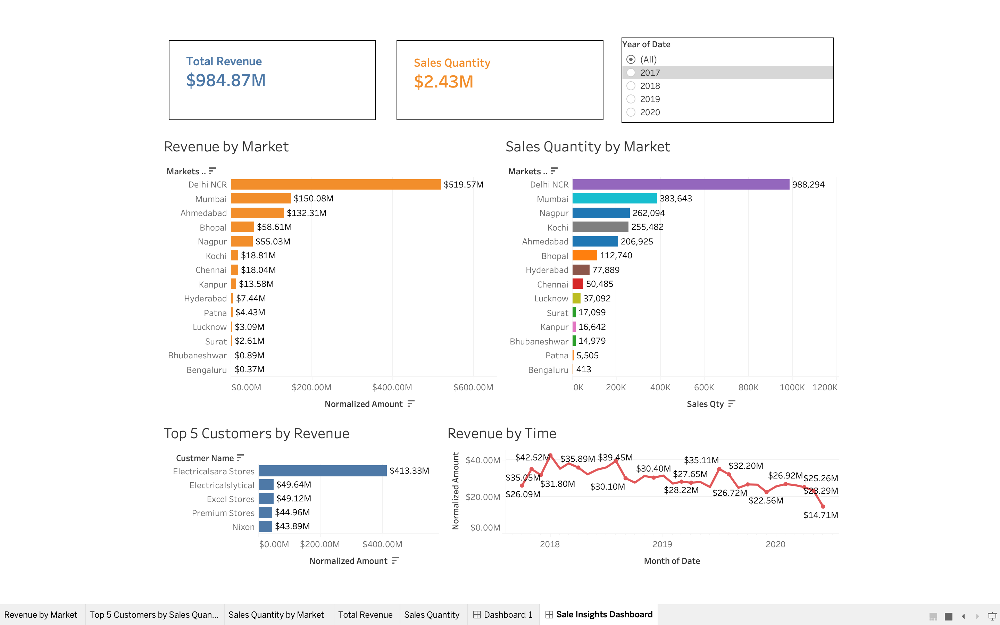

# Tableau Sales Analytics Pipeline

## Project Overview
This project provides detailed business intelligence insights into the sales of a branch shop operating across multiple markets. The insights are derived from a sales database containing customer information, transaction records, market names, and product details.

By bridging a **MySQL** database with **Tableau**, this project demonstrates a full end-to-end data pipeline—from raw SQL data to a polished, interactive dashboard used for executive decision-making.

## Tools & Technologies Used
* **Tableau Desktop:** Primary tool for data visualization and dashboard design.
* **MySQL & MySQL Workbench:** RDBMS used to store, manage, and query sales records.
* **SQL:** Used for data discovery and complex transformations.
* **MySQL JDBC Connector:** Established the live bridge between the database and the BI layer.

## 🔄 ETL Process (Extract, Transform, Load)
A rigorous ETL workflow was implemented to prepare the raw data for high-level analysis:

* **Extract:** Data was pulled from a MySQL database containing transactional records, customer profiles, market details, and product catalogs.
* **Transform:** The data was cleaned and aggregated to ensure a unified "Source of Truth." Key transformations included:
    * **Date Normalization:** Formatting dates for accurate time-series analysis.
    * **Metric Calculation:** Calculating precise revenue and sales quantities at the transaction level.
    * **Currency Normalization:** Handling mixed currency transactions (USD/INR) via calculated fields.
    * **Data Merging:** Joining tables to create a robust dataset for multi-dimensional visualization.
* **Load:** The cleaned data was loaded into Tableau, maintaining a high-performance live connection to the database.

## Data Source & Modeling
The project utilizes a **Star Schema** with the following tables:
* **Customers:** `Customer Code`, `Customer Name`, `Customer Type`
* **Transactions:** `Order Date`, `Sales Quantity`, `Sales Amount`, `Product Code`, `Market Code`, `Customer Code`, `Currency`
* **Markets:** `Market Code`, `Market Name`
* **Products:** `Product Code`, `Product Type`

🔗 **You can find the SQL dump of the database [here](https://github.com/codebasics/DataAnalysisProjects/blob/master/2_SalesInsightsTableau/db_dump.sql).**

## Key Metrics & Visualizations
* **Revenue Trend by Time:** Monthly line chart to identify growth patterns and seasonality.
* **Revenue by Market:** Performance comparison across different regions.
* **Sales Quantity by Market:** Distribution of product volume by geography.
* **Top 5 Customers by Revenue:** Identification of high-value clients driving growth.
* **Top 5 Products by Revenue:** Analysis of top-selling inventory.

## Key Features & Functionality
* **Interactive Filtering:** Global year-over-year (2017–2020) toggles.
* **KPI Tiles (BANs):** Dynamic summaries of Total Revenue and Sales Quantity.
* **Regional & Customer Analysis:** Identification of top-performing markets (Delhi NCR) and key customer segments.
* **Temporal Trends:** Monthly revenue tracking to identify seasonal sales cycles.

## 📈 Business Insights
* **Market Leader:** Analysis identifies Delhi NCR as the primary revenue driver.
* **Customer Concentration:** Top 5 customers contribute significantly to sales volume, highlighting key accounts.
* **Seasonality:** Trend analysis pinpointed peak activity months for optimized inventory planning.

